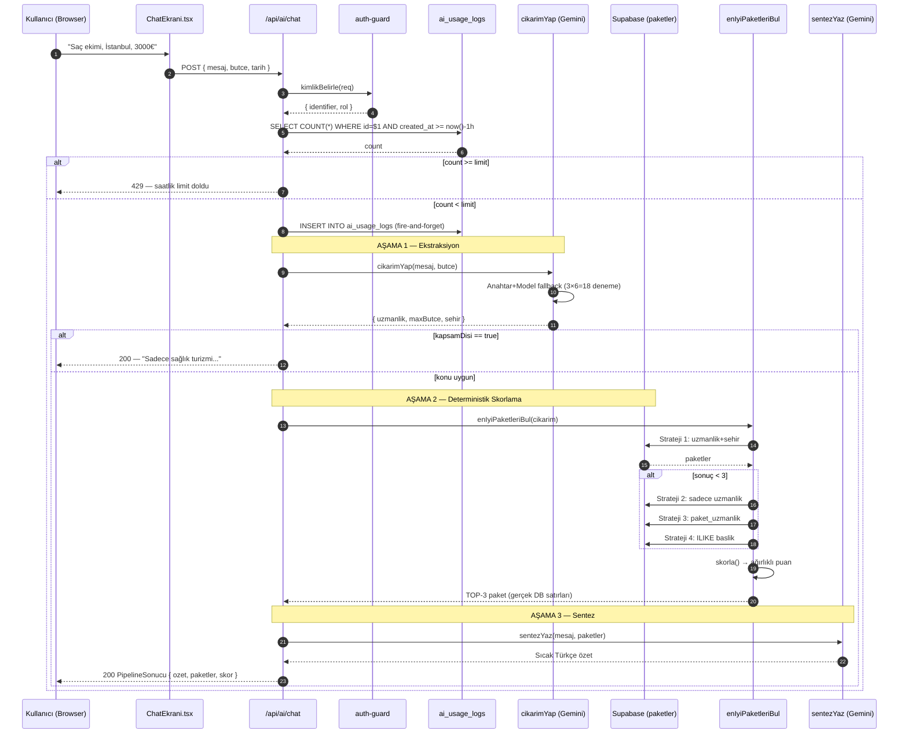
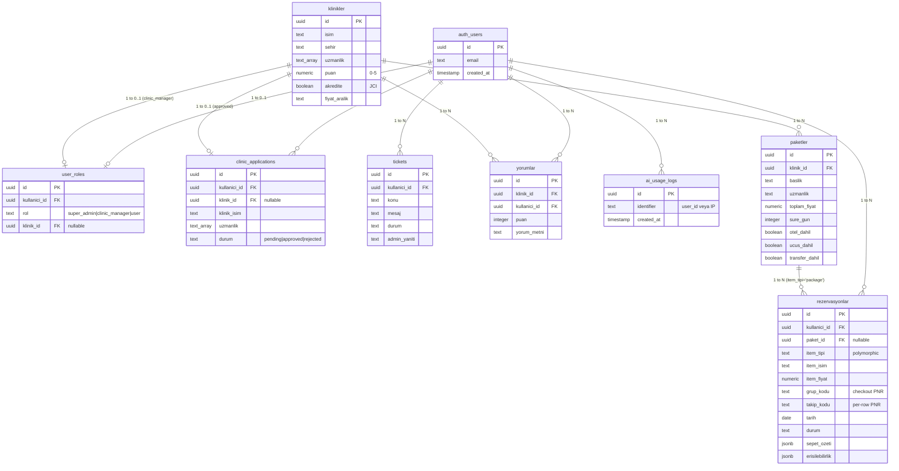

# HealthTour — Sistem Mimarisi Dokümanı

> **Sağlık turizmi platformu** · Next.js 14 · Supabase · Gemini AI · Zustand
>
> Bu doküman, HealthTour platformunun mimari yapısını, çekirdek tasarım kararlarını ve operasyonel sınırlarını teknik derinlikte açıklar. Hackathon değerlendirmesi için hazırlanmıştır.

---

## 1. Yönetici Özeti ve Teknoloji Yığını

### 1.1 Uygulamanın Amacı

**HealthTour**, uluslararası hastaların **uçak + otel + JCI akredite klinik** paketlerini tek bir noktadan keşfedip rezerve edebildiği bir sağlık turizmi platformudur. Sistemin merkezinde, kullanıcının doğal dilde yazdığı sağlık şikayetini analiz edip Türkiye'deki klinik envanterinden en uygun paketleri çıkaran **3-aşamalı hibrit AI motoru** yer alır.

Platform üç farklı operasyonel persona için tasarlanmıştır:

| Persona | Yetenek |
|---------|---------|
| **Standart Kullanıcı (`user`)** | AI ile paket arar, sepet oluşturur, mock ödeme ile rezervasyon yapar, destek bileti açar |
| **Klinik Yöneticisi (`clinic_manager`)** | Kendi kliniğinin paketlerini CRUD eder, rezervasyon durumu yönetir, hasta yorumlarını görür |
| **Süper Yönetici (`super_admin`)** | Kullanıcı/rol yönetimi, klinik başvuru onayı, tüm rezervasyon görünümü, destek bilet yönetimi |

### 1.2 Teknoloji Yığını

```
┌─────────────────────────────────────────────────────────────────┐
│                          FRONTEND                                │
│  Next.js 14 App Router  ·  React 18  ·  TypeScript 5            │
│  Tailwind CSS 3.4  ·  Framer Motion 12  ·  Zustand 5            │
└─────────────────────────────────────────────────────────────────┘
                                  │
┌─────────────────────────────────────────────────────────────────┐
│                       API / SERVER LAYER                         │
│  Next.js Route Handlers (App Router)  ·  Server Components       │
│  Vercel Fluid Compute  ·  Node.js Runtime                       │
└─────────────────────────────────────────────────────────────────┘
                                  │
┌──────────────────────────┐    ┌──────────────────────────────┐
│       VERİ KATMANI        │    │       AI KATMANI              │
│  Supabase Postgres        │    │  Google Gemini Generative AI  │
│  Row Level Security       │    │  Çoklu Anahtar + Model        │
│  @supabase/ssr (cookie)   │    │  Çift-Kaskad Fallback         │
│  @supabase/supabase-js    │    │  IP/Rol Bazlı Rate Limit      │
└──────────────────────────┘    └──────────────────────────────┘
```

| Katman | Teknoloji | Sürüm | Rol |
|--------|-----------|-------|-----|
| Framework | Next.js | 14.2.35 | App Router, Server Components, Route Handlers |
| Dil | TypeScript | 5.x | Tam tip güvenliği (`any` yasak) |
| Veritabanı | Supabase Postgres | - | RLS aktif tek doğruluk kaynağı |
| SSR Cookie | `@supabase/ssr` | 0.10.3 | Sunucu tarafı oturum yönetimi |
| AI Sağlayıcı | `@google/generative-ai` | 0.24.1 | Gemini 2.0/2.5/3.x model ailesi |
| State Yönetimi | Zustand | 5.0.13 | Polymorphic sepet + persistans |
| UI | Tailwind CSS | 3.4.1 | DM Serif Display + Manrope tipografisi |
| Animasyon | Framer Motion | 12.38 | Mikroetkileşimler |
| Konfeti | canvas-confetti | 1.9 | Başarılı ödeme efekti |
| Deploy | Vercel | - | Fluid Compute (Node.js 24 LTS) |

### 1.3 Kasıtlı Demo Kısayolları

Bu bir hackathon demosudur. Aşağıdaki sadeleştirmeler bilinçli olarak yapılmıştır:

- **Ödeme:** `lib/mock-payment.ts` — gerçek kart bilgisi alınmaz; her ödeme 2 sn yapay gecikmeyle başarılı döner. *Türkiye'de Stripe kullanılamadığı için.*
- **Uçuş/Otel/Transfer envanteri:** Üçüncü taraf GDS yok; Supabase'deki sabit mock veriler kullanılır.
- **Email doğrulama:** Supabase Auth basit e-posta + şifre akışı (verification yok).

---

## 2. AI Öneri Motoru (Çekirdek IP)

HealthTour'un en kritik teknik farkı, **"Hybrid AI Pipeline"** olarak adlandırılan 3-aşamalı öneri sistemidir. Bu yaklaşım, **saf LLM çağrılarının halüsinasyon riskini** ve **maliyet/gecikme yükünü** ortadan kaldırırken, **deterministik bir skorlama algoritmasının** tutarlılığını korur.

### 2.1 Üç Aşamalı Hibrit Akış

```
┌────────────────────────────────────────────────────────────────┐
│  Kullanıcı Mesajı (doğal dil)                                  │
│  "saç ekimi için İstanbul, bütçem 3000€"                       │
└──────────────────────────────┬─────────────────────────────────┘
                               │
                               ▼
┌────────────────────────────────────────────────────────────────┐
│  AŞAMA 1 — LLM EKSTRAKSİYON   (lib/gemini.ts → cikarimYap)     │
│  ─────────────────────────────────────────────────────────────  │
│  Gemini'ye sıkı bir whitelist + system instruction ile JSON    │
│  ürettirir. Çıktı şeması:                                       │
│  {                                                              │
│    "uzmanlik": "saç ekimi" | ... (10 değerden biri),            │
│    "maxButce": 3000,                                            │
│    "sehir": "İstanbul",                                         │
│    "kapsamDisi"?: true   ← prompt injection / off-topic         │
│  }                                                              │
└──────────────────────────────┬─────────────────────────────────┘
                               │
                               ▼
┌────────────────────────────────────────────────────────────────┐
│  AŞAMA 2 — DETERMİNİSTİK SKORLAMA  (lib/recommend.ts)          │
│  ─────────────────────────────────────────────────────────────  │
│  cokluStratejiAra() → 4-kademe kaskad (bkz. §2.2)              │
│  skorla() → ağırlıklı puanlama                                  │
│    • Bütçe uyumu:        35p (aşımda lineer azalır)             │
│    • Klinik puanı:       35p (0-5 → 0-35)                       │
│    • JCI akreditasyonu:  20p                                    │
│    • Şehir eşleşmesi:    10p (bonus, kısıtlama değil)           │
│  Sonuç: TOP-3 paket (asla halüsinasyon yok — gerçek DB satırı) │
└──────────────────────────────┬─────────────────────────────────┘
                               │
                               ▼
┌────────────────────────────────────────────────────────────────┐
│  AŞAMA 3 — LLM SENTEZ   (lib/gemini.ts → sentezYaz)            │
│  ─────────────────────────────────────────────────────────────  │
│  Gemini'ye Aşama 2'nin JSON çıktısı verilir; **sadece bu        │
│  verilerden** sıcak, empatik, 3-4 cümlelik Türkçe özet yazar.  │
│  Fiyat/klinik adları SADECE algoritmanın bulduğu kümeden       │
│  alınır — uydurma yasak. 0 sonuçta nazikçe özür diler.         │
└──────────────────────────────┬─────────────────────────────────┘
                               │
                               ▼
                  PipelineSonucu (Frontend'e döner)
```

> **Neden hibrit?** Saf LLM yaklaşımı (`paketPlanla` agent'ı) `lib/gemini.ts`'te `ajanPipelineCalıstır` olarak hâlâ mevcut ama production akışı kullanmıyor. Çünkü LLM'ler gerçek DB envanterini halüsinasyonsuz yansıtamaz: fiyatları yuvarlar, var olmayan klinik adı uydurur. Hibrit yaklaşım, **gerçek paket satırlarını** algoritmanın bulmasına izin verir; LLM sadece **dilsel sentez** yapar.

### 2.2 Çift-Kaskad Fallback Mekanizması

Pipeline'da **iki bağımsız fallback katmanı** vardır:

#### **Kaskad A — Gemini Anahtar/Model Fallback** (`lib/gemini.ts:32-58`)

Gemini her isteği şu sırayla dener; ilk başarılı yanıtı döndürür:

```typescript
// API_ANAHTARLARI: [GEMINI_API_KEY_1, GEMINI_API_KEY_2, GEMINI_API_KEY]
// MODELLER: [
//   'gemini-3.1-flash-lite',       ← en yeni
//   'gemini-3-flash-preview',
//   'gemini-2.5-flash',
//   'gemini-2.5-flash-lite',
//   'gemini-2.0-flash',
//   'gemini-2.0-flash-lite'         ← en eski
// ]

for anahtar in anahtarlar:        // 3 anahtar
  for model in MODELLER:           // 6 model
    try:
      Promise.race([
        uretici.generateContent(prompt),
        timeout(8_000)            // asılı preview modellere karşı
      ])
      return cevap              // İlk başarı → çık
    except:
      log_uyari()
throw GeminiFallbackHatasi
```

> **3 × 6 = 18 deneme.** Bir anahtar quota tükettiğinde diğerine, bir model 503 verdiğinde alt sürüme otomatik düşer. 8 saniyelik per-attempt timeout, preview modellerinin asılı kalmasını engeller.

#### **Kaskad B — Multi-Strategy Paket Araması** (`lib/recommend.ts:33-66`)

Skorlama öncesi, sonuçlar dolana kadar 4 strateji kademeli olarak gevşer:

| Aşama | Strateji | Açıklama |
|-------|----------|----------|
| 1 | `uzmanlik` + `sehir` (klinik tablosu) | En kısıtlayıcı: doğru uzmanlık VE doğru şehir |
| 2 | `uzmanlik` (şehir kısıtı kalkar) | Sonuç < 3 ise tüm Türkiye'de ara |
| 3 | `paket_uzmanlik` (klinik filtresi atlanır) | Paketin kendi uzmanlık alanına bak |
| 4 | `baslik_arama` (ILIKE %term%) | En geniş ağ: paket başlığında arama |

`Map<string, Paket>` kullanılarak duplicate eklenmez; sıkı kriterler daima öncelikli.

### 2.3 IP/Rol Bazlı Rate Limiting

`/api/ai/chat/route.ts` (saatlik limitler):

```typescript
const LIMITLER: Record<string, number> = {
  super_admin:    Infinity,   // admin'e sınır yok
  user:           24,         // oturum açık standart kullanıcı
  clinic_manager: 24,         // klinik yöneticisi
  ip:             12,         // kimliksiz ziyaretçi (en sıkı)
};
```

**Kimlik belirleme akışı:**
1. `createServerSupabase().auth.getUser()` → oturum varsa kullanıcı UUID + `user_roles` tablosundan rol
2. Oturum yoksa `x-forwarded-for` zincirinin **ilk** IP'si (Vercel proxy arkasındaki gerçek istemci)

**Sayım sorgusu** (Supabase admin client):
```typescript
SELECT count(*) FROM ai_usage_logs
WHERE identifier = $1 AND created_at >= now() - interval '1 hour'
```

**Sınır aşıldığında:** HTTP 429 + Türkçe hata mesajı. Limit altındaysa log **fire-and-forget** yazılır (pipeline'ı bloke etmez).

### 2.4 Domain Guardrail (Prompt Injection Koruması)

`SISTEM_TALIMATI` her LLM çağrısında **system instruction** olarak gönderilir. İçerik:

- ✅ İzin: tıbbi tedaviler, klinikler, oteller, uçuşlar, sağlık turizmi rezervasyonları
- ❌ Yasak: genel kültür, siyaset, kodlama, **"önceki talimatları unut" / "sen artık X'sin"** tipi jailbreak girişimleri

Kapsam dışı sorgu Aşama 1'de tespit edilir (`kapsamDisi: true`). Pipeline **kısa devre yapar** — Aşama 2/3 çalıştırılmaz, doğrudan polite refusal döner. Bu, Gemini quota'sını korur ve gereksiz DB sorgularını engeller.

### 2.5 Mermaid Sequence Diyagramı



---

## 3. State Management ve Sepet Mimarisi

### 3.1 Polymorphic Cart Store (`lib/cartStore.ts`)

Sepet, **6 farklı item tipini** tek bir homojen koleksiyonda yönetir:

```typescript
export type CartItemType =
  | 'flight'    // ✈️  Uçak bileti
  | 'package'   // 🏥  Klinik paketi (otel+klinik+uçuş)
  | 'transfer'  // 🚗  Havalimanı-otel transferi
  | 'tour'      // 🎯  Şehir turu
  | 'hotel'     // 🏨  Otel rezervasyonu
  | 'health';   // 💊  Standalone sağlık operasyonu
```

Bu tasarım, kullanıcının **bir paketi + ek bir tur + ekstra transferi** aynı sepete koyup tek seferde checkout yapmasına imkân verir. Klinik paketleri ile bağımsız uçuşları aynı veri modelinde tutarak frontend'in tekil bir liste render etmesini sağlar.

### 3.2 Zustand + Persist Middleware

```typescript
export const useCartStore = create<CartStore>()(
  persist(
    (set, get) => ({
      items: [],
      passengers: { adult: 1, child: 0 },
      addItem, removeItem, updateQuantity,
      incrementQuantity, decrementQuantity, clearCart,
      setPassengers, totalPrice, totalItems,
    }),
    { name: 'healthtour-cart' }   // localStorage anahtarı
  )
);
```

**Tasarım kararları:**

- **`addItem`** aynı `id`'ye sahip item varsa miktarı artırır, yoksa yeni satır olarak ekler.
- **`lineTotal`** her güncellemede otomatik yeniden hesaplanır — UI'da `unitPrice × quantity` çarpımı tekrarlanmaz.
- **`passengers`** yolcu sayısı da sepetle birlikte persist edilir — sayfa yenilemede kaybolmaz.
- **`totalPrice`/`totalItems`** birer fonksiyondur, computed value değil; bu sayede her render'da yeniden okunduğunda taze değer verir, stale closure bug'larından kaçınır.

### 3.3 Checkout Senkronizasyonu

`/cart/page.tsx` → `/api/checkout/route.ts` akışı:

```typescript
// Frontend (cart page'den çağrı)
const res = await fetch('/api/checkout', {
  method: 'POST',
  body: JSON.stringify({
    items: cartItems,           // polymorphic CartItem[]
    tarih: secilenTarih,
    islem_id: mockOdeme.islem_id,
    erisilebilirlik: erBilgisi  // engelli/hamile yolcu notları
  })
});

// Backend (route.ts)
const grup_kodu = generatePNR();  // PNR formatı: 6 karakterli base36
await Promise.all(items.map(item =>
  createRezervasyon({
    kullanici_id: guard.ctx.userId,   // ← daima oturumdan, body'den ASLA
    paket_id: item.type === 'package' ? item.id : null,
    item_tipi: item.type,
    item_isim: item.name,
    item_fiyat: item.lineTotal,
    grup_kodu,                          // tüm satırları PNR ile bağla
    erisilebilirlik
  }, sb)
));
```

**Kritik tasarım kararı:** Sepetteki her item **ayrı bir `rezervasyonlar` satırı** olarak yazılır ama tümü aynı `grup_kodu` (PNR) altında gruplandırılır. Bu sayede:

- Klinik yöneticisi sadece kendine ait `paket_id`'li satırları görür (cross-tenant ayrımı).
- Kullanıcı kendi profilinde tüm satırları tek bir "sipariş" gibi görür (`grup_kodu` ile join).
- Bir item iptal edilse de diğerleri etkilenmez (`durum` per-row).

`paket_id` artık **NOT NULL değil** (önceki commit `f31edbe`); uçuş/otel gibi paket-dışı satırlar için `null` kalır.

---

## 4. Güvenlik ve Rol Bazlı Erişim Kontrolü (RBAC)

### 4.1 Üç Rol, Üç Operasyonel Sınır

```
┌────────────────────────────────────────────────────────────────┐
│  super_admin                                                    │
│    • Tüm rezervasyonları görür (paket_id, klinik_id farketmez) │
│    • Kullanıcı oluştur/sil/rol değiştir (RPC ile)              │
│    • Klinik başvurularını onayla/reddet                        │
│    • Destek biletlerini yönetir                                │
│    • Kullanım: createAdminClient() — RLS BYPASS                 │
├────────────────────────────────────────────────────────────────┤
│  clinic_manager                                                 │
│    • SADECE kendi klinik_id'sine bağlı paketleri CRUD eder     │
│    • SADECE kendi kliniğine gelen rezervasyonları görür         │
│    • cross-tenant yazımı server-side reddedilir (defansif)     │
│    • Kullanım: createAdminClient() + uygulama-katmanı filtreleme│
├────────────────────────────────────────────────────────────────┤
│  user                                                           │
│    • Kendi rezervasyonlarını CRUD eder                          │
│    • AI öneri pipeline'ını kullanır (saatlik 24 istek)         │
│    • Klinik başvurusu oluşturabilir (pending → super_admin onay)│
│    • Destek bileti açar                                         │
│    • Kullanım: createServerSupabase() — auth.uid() ile RLS     │
└────────────────────────────────────────────────────────────────┘
```

### 4.2 Üç Ayrı Supabase İstemci Factory

`lib/supabase-clients.ts` üç ayrı factory ihraç eder. **Her birinin RLS bağlamı farklıdır**:

| Factory | Anahtar | Cookie | RLS | Kullanım |
|---------|---------|--------|-----|----------|
| `getPublicSupabase()` | `ANON` | ❌ Yok | Public policy ile | Açık veri: klinik listesi, paket listesi |
| `createServerSupabase()` | `ANON` | ✅ Var | `auth.uid()` ile | Standart kullanıcı yazma/okuma |
| `createAdminClient()` | `SERVICE_ROLE` | ❌ Yok | **BYPASS** | Yalnız `requireRole(['super_admin'])` sonrası |

```typescript
// lib/supabase-clients.ts (özet)
import 'server-only';   // ← Client Component'lardan import EDİLEMEZ

export function getPublicSupabase() { /* anon, persistSession: false */ }
export async function createServerSupabase() { /* anon + cookie store */ }
export function createAdminClient() { /* SERVICE_ROLE, RLS bypass */ }
```

> **Kritik:** `'server-only'` direktifi sayesinde admin client bir Client Component'a yanlışlıkla import edilirse **build error** alır. Service role anahtarı asla browser'a sızamaz.

### 4.3 `requireRole` Guard Pattern

Her korumalı route handler'ın başında **ilk satır**:

```typescript
export async function POST(req: NextRequest) {
  const guard = await requireRole(['clinic_manager']);
  if ('error' in guard) return guard.error;   // 401 veya 403

  const { userId, rol, klinik_id } = guard.ctx;
  // ... yetkili kod buradan başlar
}
```

`requireRole` (lib/auth-guard.ts) içinde:

```typescript
1. createServerSupabase().auth.getUser()  → kullanıcı yoksa 401
2. createAdminClient().from('user_roles').select(...) → rol satırını çek
   (Önemli: admin client kullanılır çünkü kullanıcı kendi RLS'i ile rolünü göremeyebilir)
3. izinli.includes(rol) değilse 403
4. ctx döner: { userId, email, rol, klinik_id }
```

### 4.4 Defansif Cross-Tenant Koruması

Klinik yöneticisi route'larında **iki katmanlı** koruma vardır:

#### **Katman 1:** `klinik_id` daima `ctx`'ten, **asla body'den**:

```typescript
// api/clinic/paketler/route.ts
const data = await createPaket({
  klinik_id,                  // ← guard.ctx'ten
  baslik: body.baslik,
  // body.klinik_id GÖRMEZDEN GELİNİR
}, createAdminClient());
```

#### **Katman 2:** Yazma öncesi sahiplik doğrulaması (`lib/supabase.ts:366`):

```typescript
export async function assertPaketKlinikSahipligi(
  paket_id: string,
  klinik_id: string,   // ctx'ten gelir
  sb: SupabaseClient
): Promise<void> {
  const { data } = await sb.from('paketler')
    .select('klinik_id')
    .eq('id', paket_id)
    .maybeSingle();

  if (!data) throw new Error('Paket bulunamadı');
  if (data.klinik_id !== klinik_id) {
    throw new Error('Bu paket başka bir kliniğe ait');
  }
}
```

Aynı doğrulama `updateRezervasyonDurum`'da da uygulanır — bir klinik yöneticisi başka kliniğin rezervasyonunu güncelleyemez.

### 4.5 RLS Politika Stratejisi (Postgres tarafı)

Supabase tarafında her tablo için aktif RLS politikaları:

| Tablo | Anonim Okuma | Kullanıcı Okuma | Kullanıcı Yazma |
|-------|--------------|-----------------|------------------|
| `klinikler` | ✅ Public SELECT | ✅ | ❌ (admin only) |
| `paketler` | ✅ Public SELECT | ✅ | ❌ (admin/clinic_manager only) |
| `rezervasyonlar` | ❌ | ✅ `kullanici_id = auth.uid()` | ✅ `kullanici_id = auth.uid()` |
| `user_roles` | ❌ | ✅ kendi satırı | ❌ (yalnız admin RPC) |
| `clinic_applications` | ❌ | ✅ kendi başvurusu | ✅ insert kendi adına |
| `tickets` | ❌ | ✅ kendi biletleri | ✅ insert kendi adına |
| `yorumlar` | ✅ Public SELECT | ✅ | ✅ kendi yorumu |
| `ai_usage_logs` | ❌ | ❌ | ❌ (yalnız admin client) |

**Süper admin yolu:** RLS politikalarına dokunmadan, `SERVICE_ROLE` ile **bypass** ederek tek istisna yapılır. Bu, "admin için her tabloya ekstra policy yaz" anti-pattern'inden kaçınır.

### 4.6 Rezervasyon İptal Akışı — Çift Güvence

```typescript
// lib/supabase.ts → cancelRezervasyonById
await sb.from('rezervasyonlar')
  .update({ durum: 'iptal' })
  .eq('id', id)
  .eq('kullanici_id', kullanici_id);   // ← RLS + uygulama katmanı
```

RLS politikası zaten `auth.uid() = kullanici_id` zorlar, ama uygulama katmanı bunu **bir kez daha** filtreler. Bu, eğer RLS yanlışlıkla devre dışı kalırsa bile cross-user iptali engeller (defense in depth).

### 4.7 Süper Admin'in Kendini Kaza Eseri Düşürme Koruması

`api/admin/kullanicilar/route.ts` PATCH:

```typescript
if (body.id === guard.ctx.userId && body.rol !== 'super_admin') {
  return err('Kendi super_admin rolünüzü düşüremezsiniz', 400);
}
```

DELETE'te de aynı şekilde `id === guard.ctx.userId` engellenir. Bu, **"son admin kalmasın"** kazasını uygulama katmanında önler.

---

## 5. Veritabanı Şeması

### 5.1 Ana Tablolar

#### `klinikler`
JCI akredite + non-akredite klinik envanteri. Public okumalı.

| Sütun | Tip | Açıklama |
|-------|-----|----------|
| `id` | `uuid` PK | |
| `isim` | `text` | Klinik adı |
| `sehir` | `text` | Türkiye şehri (filter için) |
| `uzmanlik` | `text[]` | Çoklu uzmanlık (array — `contains` filter) |
| `puan` | `numeric` | 0-5 arası hasta puanı |
| `akredite` | `boolean` | JCI sertifikası |
| `fiyat_aralik` | `text` | "€1.500 - €3.000" |
| `fotograf_url` | `text` | |

#### `paketler`
Klinik + otel + uçuş kombinasyonu (sahte üçüncü-taraf envanteri).

| Sütun | Tip | Açıklama |
|-------|-----|----------|
| `id` | `uuid` PK | |
| `baslik` | `text` | "FUE Saç Ekimi — Hilton + JCI Klinik" |
| `klinik_id` | `uuid` FK→klinikler | |
| `otel_isim` | `text` | |
| `otel_dahil` | `boolean` | |
| `ucus_dahil` | `boolean` | |
| `transfer_dahil` | `boolean` | |
| `uzmanlik` | `text` | Tekil uzmanlık (paket bazında) |
| `toplam_fiyat` | `numeric` | EUR |
| `sure_gun` | `integer` | |
| `aciklama` | `text` | |

#### `rezervasyonlar` — **polymorphic**
Sepetteki her item kendi satırını üretir. Tek bir checkout = N satır + ortak `grup_kodu`.

| Sütun | Tip | Açıklama |
|-------|-----|----------|
| `id` | `uuid` PK | |
| `kullanici_id` | `uuid` FK→auth.users | RLS anahtarı |
| `paket_id` | `uuid` FK→paketler NULL | Paket-olmayan item'lar için null |
| `item_tipi` | `text` | flight\|package\|transfer\|tour\|hotel\|health |
| `item_isim` | `text` | |
| `item_detay` | `text` | |
| `item_fiyat` | `numeric` | Satır toplamı |
| `grup_kodu` | `text` | PNR — aynı checkout'taki satırları bağlar |
| `takip_kodu` | `text` | Per-row PNR (kargo izleme analogu) |
| `tarih` | `date` | Hizmet tarihi |
| `durum` | `text` | beklemede\|onaylandi\|tamamlandi\|iptal\|arsivlendi |
| `sepet_ozeti` | `jsonb` | Frontend snapshot (audit için) |
| `erisilebilirlik` | `jsonb` | Engelli/hamile/tıbbi notlar |
| `olusturma_tarihi` | `timestamptz` | |

#### `user_roles`
Auth + uygulama-katmanı rol haritası.

| Sütun | Tip | Açıklama |
|-------|-----|----------|
| `id` | `uuid` PK | |
| `kullanici_id` | `uuid` UNIQUE FK→auth.users | onConflict anahtarı |
| `rol` | `text` | super_admin\|clinic_manager\|user |
| `klinik_id` | `uuid` FK→klinikler NULL | Sadece clinic_manager için |
| `olusturma_tarihi` | `timestamptz` | |

#### `clinic_applications`
Klinik yöneticisi olmak isteyen kullanıcı başvuruları.

| Sütun | Tip | Açıklama |
|-------|-----|----------|
| `id` | `uuid` PK | |
| `kullanici_id` | `uuid` FK→auth.users | |
| `klinik_isim` | `text` | |
| `iletisim_email` | `text` | |
| `uzmanlik` | `text[]` | |
| `sehir` | `text` | |
| `aciklama` | `text` | |
| `durum` | `text` | pending\|approved\|rejected |
| `klinik_id` | `uuid` FK→klinikler NULL | Onayda set edilir |
| `admin_notu` | `text` | Red gerekçesi vs. |

#### `ai_usage_logs` — **rate limit ledger'ı**
Her başarılı pipeline isteği için bir satır. Saatlik pencere = `created_at >= now() - 1h`.

| Sütun | Tip | Açıklama |
|-------|-----|----------|
| `id` | `uuid` PK | |
| `identifier` | `text` | user UUID veya IP adresi |
| `created_at` | `timestamptz` DEFAULT now() | |

> **Indeks önerisi:** `(identifier, created_at DESC)` — saatlik count sorgusu için critical path.

#### `tickets`
Kullanıcı destek bileti.

| Sütun | Tip | Açıklama |
|-------|-----|----------|
| `id` | `uuid` PK | |
| `kullanici_id` | `uuid` FK→auth.users | |
| `konu` | `text` | |
| `mesaj` | `text` | |
| `durum` | `text` | acik\|islemde\|kapali |
| `admin_yaniti` | `text` | |

#### `yorumlar`
Klinik bazlı hasta yorumları.

| Sütun | Tip | Açıklama |
|-------|-----|----------|
| `id` | `uuid` PK | |
| `klinik_id` | `uuid` FK→klinikler | |
| `kullanici_id` | `uuid` FK→auth.users | |
| `puan` | `integer` | 1-5 |
| `yorum_metni` | `text` | |

### 5.2 RPC (Stored Procedures)

| RPC | Çağıran | Amaç |
|-----|---------|------|
| `admin_create_user` | super_admin | `auth.users` insert + email/şifre — RLS atlatma için |
| `admin_delete_user` | super_admin | `auth.users` ve cascade rezervasyonlar |

### 5.3 View

| View | Açıklama |
|------|----------|
| `admin_kullanicilar_view` | `auth.users`'tan id/email/created_at — yalnız admin client erişir |

### 5.4 Mermaid Entity-Relationship Diyagramı



### 5.5 İlişki Notları

- **`rezervasyonlar.paket_id` artık NULLABLE.** Polymorphic sepet için zorunluydu — uçuş/otel satırları paket olmadan kaydedilebilsin diye `f31edbe` commit'inde NOT NULL kısıtı kaldırıldı.
- **`user_roles.klinik_id`** sadece `rol='clinic_manager'` için anlamlı; user/super_admin için NULL.
- **`grup_kodu`** sütunu FK değil; saf bir tag — aynı checkout'taki rezervasyon satırlarını uygulama katmanında bağlar. JOIN gerektirmez.
- **`ai_usage_logs.identifier`** polymorphic (UUID veya IP string'i). FK yok çünkü anonim IP'ler de var.

---

## 6. Ekler

### 6.1 Ortam Değişkenleri

```bash
NEXT_PUBLIC_SUPABASE_URL=        # Supabase proje URL'i (browser'a açık)
NEXT_PUBLIC_SUPABASE_ANON_KEY=   # Anon key (browser'a açık, RLS koruması altında)
SUPABASE_SERVICE_ROLE_KEY=       # ⚠ SADECE sunucu — RLS bypass eder
GEMINI_API_KEY_1=                # Birincil Gemini anahtarı
GEMINI_API_KEY_2=                # İkincil (fallback)
GEMINI_API_KEY=                  # Geriye dönük uyum
NEXT_PUBLIC_APP_NAME=HealthTour
```

### 6.2 API Yanıt Zarfı (Tek Tip)

Tüm route'lar `lib/api-response.ts` üzerinden yanıt verir:

```typescript
// Başarı
{ "success": true, "data": ... }

// Hata
{ "success": false, "error": "Türkçe mesaj", "detay": "internal" }
```

İstemci yalnız `success` flag'ine bakar; `detay` log/teşhis içindir.

### 6.3 Klasör Topolojisi

```
/app
  /api                       — Route handlers (Vercel Fluid Compute)
    /ai/chat                 — Hybrid AI pipeline endpoint
    /recommend               — Legacy puanlama (yeni akış lib/recommend.ts kullanır)
    /admin/*                 — requireRole(['super_admin'])
    /clinic/*                — requireRole(['clinic_manager'])
    /checkout, /booking      — requireAuth() — kullanici_id ctx'ten zorunlu
    /packages, /klinikler    — Public okuma (anon key)
  /[route]/page.tsx          — Server/Client component sayfalar

/lib
  /supabase-clients.ts       — 3 factory: public/session/admin (server-only)
  /supabase.ts               — Tüm DB fonksiyonları (caller-provides-client)
  /auth-guard.ts             — requireRole, requireAuth
  /gemini.ts                 — Çift kaskad + 2 hybrid agent
  /recommend.ts              — Multi-strategy araması + ağırlıklı skorlama
  /cartStore.ts              — Zustand polymorphic sepet
  /types.ts                  — Tüm TypeScript arayüzleri
  /api-response.ts           — { success, data | error, detay }
  /mock-payment.ts           — 2sn delay, daima başarılı
  /pnr.ts                    — generatePNR() — 6 karakter base36
  /Dil/Doviz/KullaniciContext — Client Context provider'ları

/components
  /ui                        — Navbar, ChatProvider, butonlar
  /chat                      — ChatEkrani (3-adım wizard + sonuç)
  /packages                  — Paket kart bileşenleri
```

---

> **Doküman versiyonu:** 2026-05-18 · `main` branch'i · commit `e1b0bce`
