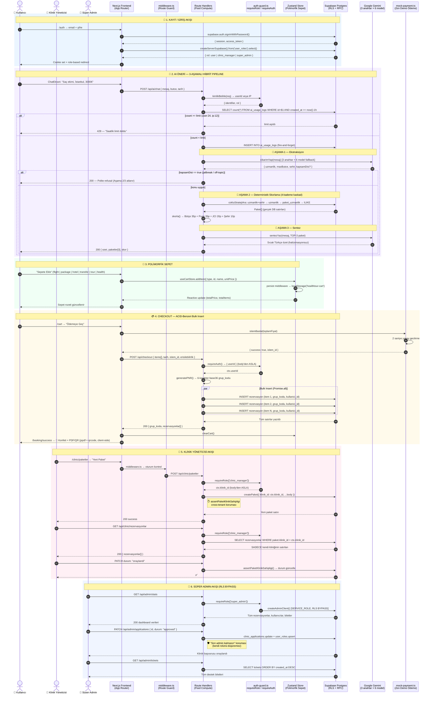

<div align="center">

# 🏥 HealthTour

### _Türkiye'nin Yapay Zeka Destekli Sağlık Turizmi Platformu_

**Uçak + Otel + JCI Akredite Klinik paketlerini tek bir noktadan, doğal dil ile keşfedin — Gemini destekli 3-aşamalı hibrit AI motoru sizin için en uygun tedaviyi bulsun.**

---

[](https://nextjs.org/)
[](https://www.typescriptlang.org/)
[](https://react.dev/)
[](https://supabase.com/)
[](https://tailwindcss.com/)
[](https://ai.google.dev/)
[](https://zustand-demo.pmnd.rs/)
[](https://www.framer.com/motion/)
[](https://vercel.com/)

</div>

---

## 🎯 Asansör Tanıtımı

> **HealthTour**, uluslararası hastaların doğal dilde yazdığı sağlık şikayetini **3-aşamalı hibrit Gemini AI motoru** ile analiz edip; **uçuş, otel ve JCI akredite klinik** paketlerini deterministik bir skorlama algoritmasıyla eşleştiren, **rol bazlı erişim kontrolü (RBAC)** ile güvence altına alınmış uçtan uca bir sağlık turizmi platformudur.

---

## ✨ Öne Çıkan Özellikleri

### 1. 🧠 3-Aşamalı Hibrit AI Pipeline
Saf LLM çağrılarının halüsinasyon riskini ortadan kaldıran, **deterministik skorlama + LLM sentezi** karışımı:

```
Kullanıcı Girdisi (doğal dil)
    │
    ▼
[ 1️⃣ Gemini Ekstraksiyon ] ──► { uzmanlik, maxButce, sehir, kapsamDisi? }
    │
    ▼
[ 2️⃣ Deterministik Skorlama ] ──► Bütçe 35p · Puan 35p · JCI 20p · Şehir 10p
    │
    ▼
[ 3️⃣ Gemini Sentez ] ──► Sıcak, empatik Türkçe özet (SADECE gerçek DB satırlarından)
    │
    ▼
TOP-3 Paket ✅
```

> **Neden hibrit?** LLM, fiyatları yuvarlamadan ya da var olmayan klinik adı uydurmadan gerçek envanteri yansıtamaz. Gerçek paketleri **algoritma** bulur, LLM yalnızca **dilsel sentez** yapar.

### 2. 🔁 Çift-Kaskad API Fallback
**18 katmanlı dayanıklılık.** Gemini her isteği şu sırayla dener; ilk başarılıyı döndürür:

| Katman | Mekanizma | Kapsam |
|---|---|---|
| **Anahtar** | `GEMINI_API_KEY_1` → `_2` → legacy | 3 API anahtarı |
| **Model** | `gemini-3.1-flash-lite` → `3-flash-preview` → `2.5-flash` → `2.5-flash-lite` → `2.0-flash` → `2.0-flash-lite` | 6 model |
| **Timeout** | `Promise.race` + 8 sn limit | Asılı preview modelleri keser |

**3 × 6 = 18 deneme.** Quota tükenirse, 503 alırsa, model timeout'a girerse — sistem ayakta kalır.

Ek olarak: **Paket araması da 4-kademe kaskad** ile çalışır (`uzmanlik+sehir` → `uzmanlik` → `paket_uzmanlik` → `ILIKE %baslik%`). Sonuç dolana kadar kriterler kademeli gevşer.

### 3. 🛒 Polimorfik Sepet & ACID Checkout
Tek bir sepette **6 farklı item tipini** homojen yönetiyoruz:

```typescript
type CartItemType = 'flight' | 'package' | 'transfer' | 'tour' | 'hotel' | 'health';
```

Checkout'ta her item ayrı bir `rezervasyonlar` satırına yazılır, ama hepsi **ortak `grup_kodu` (PNR)** ile bağlanır → kullanıcı tek bir sipariş görür, klinik yöneticisi yalnız kendi `paket_id`'sini görür, bir item iptal edilse diğerleri etkilenmez. `Promise.all` ile **bulk transactional insert**.

### 4. 🔐 Sıkı Rol Bazlı Erişim Kontrolü (RBAC)
**3 ayrı Supabase istemcisi**, **3 ayrı RLS bağlamı**, **defense-in-depth**:

| Factory | Anahtar | RLS | Kullanım |
|---|---|---|---|
| `getPublicSupabase()` | ANON | Public policy | Açık veri |
| `createServerSupabase()` | ANON + Cookie | `auth.uid()` | Standart kullanıcı |
| `createAdminClient()` | SERVICE_ROLE | **BYPASS** | Sadece `requireRole(['super_admin'])` sonrası |

Her korumalı route'ta `requireRole` guard'ı + `assertPaketKlinikSahipligi` ile **cross-tenant** koruması. Admin'in kendi rolünü düşürmesi bile engellenir. `'server-only'` direktifi sayesinde service role anahtarı tarayıcıya **sızamaz**.

### 5. ⚡ Akıllı Rate Limiting + Prompt Injection Guardrail
`ai_usage_logs` tablosu ile saatlik kullanım sayacı:

```
super_admin    → ∞ istek
user           → 24/saat
clinic_manager → 24/saat
ip (anonim)    → 12/saat   ← en sıkı
```

Kapsam-dışı sorgular (jailbreak, off-topic) **Aşama 1'de tespit edilir**, pipeline kısa devre yapar → Gemini quota'sı korunur.

### 6. 🧾 İstemci-Taraflı PDF & QR Üretimi
`jspdf` + `qrcode` + `canvas-confetti`. Rezervasyon onayı:
- ✅ Anında PDF biletini cihazda üretir (sunucu yükü = 0)
- ✅ QR kod ile takip kodunu gömer
- ✅ Konfeti efekti ile dönüşüm psikolojisi

---

## 🏛️ Mimari & Teknoloji Yığını

```
┌─────────────────────────────────────────────────────────────────┐
│                          FRONTEND                                │
│  Next.js 14 App Router  ·  React 18  ·  TypeScript 5            │
│  Tailwind CSS 3.4  ·  Framer Motion 12  ·  Zustand 5            │
└─────────────────────────────────────────────────────────────────┘
                                  │
┌─────────────────────────────────────────────────────────────────┐
│                       API / SERVER LAYER                         │
│  Next.js Route Handlers  ·  Server Components  ·  ISR            │
│  Vercel Fluid Compute  ·  Node.js 24 LTS                        │
└─────────────────────────────────────────────────────────────────┘
                                  │
┌──────────────────────────┐    ┌──────────────────────────────┐
│       VERİ KATMANI        │    │       AI KATMANI              │
│  Supabase Postgres        │    │  Google Gemini (2.x / 3.x)   │
│  Row Level Security       │    │  Çoklu Anahtar + Model        │
│  Realtime Dashboards      │    │  Çift-Kaskad Fallback         │
│  @supabase/ssr (cookie)   │    │  IP/Rol Bazlı Rate Limit      │
└──────────────────────────┘    └──────────────────────────────┘
```

| Katman | Teknoloji | Sürüm | Rol |
|---|---|---|---|
| 🎨 **Framework** | Next.js | 14.2.35 | App Router, Server Components, ISR, Route Handlers |
| 💎 **Dil** | TypeScript | 5.x | Tam tip güvenliği (`any` yasak) |
| 🗄️ **Veritabanı** | Supabase Postgres | - | Tek doğruluk kaynağı, RLS aktif, Realtime kanal |
| 🔑 **SSR Auth** | `@supabase/ssr` | 0.10.3 | HTTP-only cookie, sunucu-taraflı oturum |
| 🤖 **AI Sağlayıcı** | `@google/generative-ai` | 0.24.1 | Gemini 2.0 → 3.1 model ailesi |
| 🛒 **State** | Zustand | 5.0.13 | Polimorfik sepet + `persist` middleware |
| 🎨 **UI** | Tailwind CSS | 3.4.1 | Mobil-öncelikli, DM Serif Display + Manrope |
| 💫 **Animasyon** | Framer Motion | 12.38 | Mikroetkileşimler, sayfa geçişleri |
| 📄 **PDF / QR** | jspdf + qrcode | 4.2 / 1.5 | İstemci-taraflı bilet üretimi |
| 🎉 **Konfeti** | canvas-confetti | 1.9 | Başarılı ödeme efekti |
| 🚀 **Deploy** | Vercel | - | Fluid Compute, Edge CDN, Otomatik HTTPS |

### 🔐 Güvenlik Mimarisi (RBAC Özet)

| Persona | Yetenek | Erişim Sınırı |
|---|---|---|
| 👤 **user** | AI önerisi, sepet, mock ödeme, destek bileti | Kendi `auth.uid()` satırları |
| 🏥 **clinic_manager** | Paket CRUD, rezervasyon yönetimi, yorum görme | Yalnız kendi `klinik_id`'si |
| 👑 **super_admin** | Kullanıcı/rol/klinik/bilet yönetimi | RLS BYPASS (audit'li) |

---

## 🚀 Yerel Kurulum (Getting Started)

### 1️⃣ Depoyu klonlayın

```bash
git clone https://github.com/<kullanici>/healthTourism.git
cd healthTourism
```

### 2️⃣ Bağımlılıkları yükleyin

```bash
npm install
```

### 3️⃣ Ortam değişkenlerini ayarlayın

Projenin kök dizininde `.env.local` dosyası oluşturun ve aşağıdaki değişkenleri ekleyin:

```bash
# 🗄️ Supabase
NEXT_PUBLIC_SUPABASE_URL=https://<proje>.supabase.co
NEXT_PUBLIC_SUPABASE_ANON_KEY=eyJhbGc...                # Public (browser'a açık)
SUPABASE_SERVICE_ROLE_KEY=eyJhbGc...                    # ⚠️ SADECE sunucu — RLS bypass

# 🤖 Google Gemini (https://aistudio.google.com)
GEMINI_API_KEY_1=AIza...                                # Birincil
GEMINI_API_KEY_2=AIza...                                # Fallback
GEMINI_API_KEY=AIza...                                  # Geriye dönük uyum

# 🏷️ Uygulama
NEXT_PUBLIC_APP_NAME=HealthTour
```

> ⚠️ **Güvenlik notu:** `SUPABASE_SERVICE_ROLE_KEY` asla `NEXT_PUBLIC_` ön ekiyle başlatılmamalıdır. `lib/supabase-clients.ts` içindeki `'server-only'` direktifi bu sızıntıyı build-time'da engeller.

### 4️⃣ Geliştirme sunucusunu başlatın

```bash
npm run dev
```

Tarayıcınızda [`http://localhost:3000`](http://localhost:3000) adresini açın. 🎉

### 5️⃣ Production build

```bash
npm run build
npm run start
```

---

## 📂 Proje Klasör Topolojisi

```
/app
  /api                       → Route handlers (Vercel Fluid Compute)
    /ai/chat                 → 🧠 Hibrit AI pipeline endpoint
    /admin/*                 → 👑 requireRole(['super_admin'])
    /clinic/*                → 🏥 requireRole(['clinic_manager'])
    /checkout, /booking      → 🛒 Polimorfik sepet checkout
  /[route]/page.tsx          → Server/Client component sayfalar

/lib
  /gemini.ts                 → 🔁 Çift kaskad LLM (3 anahtar × 6 model)
  /recommend.ts              → 🎯 Multi-strategy araması + ağırlıklı skorlama
  /supabase-clients.ts       → 🔐 3 factory: public/session/admin (server-only)
  /auth-guard.ts             → 🛡️ requireRole, requireAuth
  /cartStore.ts              → 🛒 Zustand polimorfik sepet (persist)
  /pnr.ts                    → 🎫 generatePNR() — 6-karakter base36
  /mock-payment.ts           → 💳 Demo ödeme (Stripe Türkiye'de yok)

/components
  /ui                        → Navbar, ChatProvider, butonlar
  /chat                      → ChatEkrani (3-adım wizard + sonuç)
  /packages                  → Paket kart bileşenleri
```

---

## 🧪 Demo Kısayolları (Bilinçli Sadeleştirmeler)

Bu bir hackathon demosudur. Aşağıdaki sadeleştirmeler **bilinçli** olarak yapılmıştır:

- 💳 **Ödeme** — `lib/mock-payment.ts` üzerinden simüle edilir, gerçek kart bilgisi **asla** istenmez/işlenmez (Stripe Türkiye'de aktif değil).
- ✈️ **Uçuş/Otel/Transfer envanteri** — Üçüncü taraf GDS yerine Supabase'deki mock veriler.
- 📧 **E-posta doğrulama** — Basit Supabase Auth e-posta + şifre akışı.

---

## 🔄 Uçtan Uca Sistem Akışı (Sequence Diyagramı)

Aşağıdaki Mermaid diyagramı, **kullanıcının giriş yapmasından paket önerisi almasına, sepete eklemesinden mock ödemeye, klinik yöneticisinin onayından admin denetimine kadar** tüm aktör etkileşimlerini gösterir. Bu, sistemin **son halinin** uçtan uca röntgenidir.



> **Diyagramın anlattığı 6 kritik mimari özellik:**
> 1. **Cookie tabanlı SSR oturum** — `middleware.ts` her isteği guard eder.
> 2. **Hibrit AI** — Aşama 1 → Skorlama → Aşama 3 sırası deterministik kalır; halüsinasyon imkânsız.
> 3. **Rate limit + jailbreak guardrail** — Pipeline başında kısa devre yapar, Gemini quota'sını korur.
> 4. **Polimorfik sepet** — 6 farklı item tipi, tek bir `grup_kodu` (PNR) altında ACID-benzeri bulk insert.
> 5. **Defense-in-depth RBAC** — `klinik_id` daima `ctx`'ten gelir, body'den asla. `assertPaketKlinikSahipligi` cross-tenant koruması.
> 6. **Service role izolasyonu** — `createAdminClient()` yalnız `requireRole(['super_admin'])` sonrası, `'server-only'` direktifi ile build-time enforced.

---

## 📜 Daha Derine İnin

- 🏛️ **Sistem Mimarisi:** [`ARCHITECTURE.md`](./ARCHITECTURE.md) — Tam mimari dokümanı, ER diyagramı, RLS politika matrisi ve AI pipeline derin analizi

---

<div align="center">

**🏥 HealthTour** — _Bir hackathon projesi olarak doğdu, üretim seviyesi mimari ile yetişti._

Türkiye'nin sağlık turizmindeki **uluslararası gücünü dijitalleştirmek** için yapıldı.

</div>
